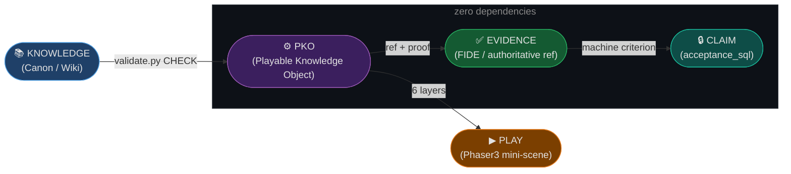

# game-codex — Playable Knowledge Factory

[](https://github.com/Igorz1993/game-codex/actions/workflows/selftest.yml)
[](LICENSE-CODE)
[](LICENSE)

---



> **Core Principle: Every important CLAIM in this repository has an executable CHECK.**
> `CLAIM ──► CHECK ──► EXECUTION ──► RESULT ──► EVIDENCE`

---

## What is a PKO?

A **Playable Knowledge Object (PKO)** is the minimum unit of this factory.
One game rule → one PKO → seven representations of the same knowledge:

| Layer | Purpose |
|---|---|
| `answer` | Human-readable explanation |
| `evidence` | Authoritative reference (FIDE rule, paper, etc.) |
| `model` | Formal preconditions and logic |
| `play` | Phaser3 interactive mini-scene config |
| `quiz` | Questions to test understanding |
| `machine` | `acceptance_sql` — machine-checkable criterion |

```bash
node selftest.mjs   # verifies structure + all PKOs
```

No dependencies, no network, no database, no keys — just Node 18+.

---

## Quick start

```bash
git clone https://github.com/Igorz1993/game-codex
cd game-codex
node selftest.mjs
```

To validate all PKO atoms against the XKS schema:

```bash
python packages/knowledge-api/validate.py
```

---

## Monorepo layout

```
packages/
  knowledge-api/   ← XKS validator (from knowledge-matrix-contour)
  auditor/         ← PKO structural auditor (from DaemonTycoon)
  game-shell/      ← Phaser3 Play-layer renderer (from Game)

knowledge/
  pko/             ← PKO atoms: *.pko.json

selftest.mjs       ← C-05: every claim has a check
LICENSE            ← CC BY 4.0 — knowledge atoms, schemas, docs
LICENSE-CODE       ← MIT — code
```

---

## What is not here

- No full game engine — we use existing Phaser3.
- No AI model — evidence must be authoritative (FIDE rules, papers, etc.).
- No external users yet. Zero. The first fork that runs the selftest will be the first.

---

## P1: Chess vertical slice

First PKO atom: [`knowledge/pko/chess-en-passant-001.pko.json`](knowledge/pko/chess-en-passant-001.pko.json)

**Claim:** En passant is a special pawn capture valid only on the turn immediately after an opponent's double pawn advance.
**Evidence:** FIDE Laws of Chess 2023, Article 3.7(d).
**Status:** All 6 layers complete. selftest GREEN.

---

## Donors (Phase A Forensic Merge Map)

This repo is a merger of 4 existing repos. The full asset-by-asset classification
(ADOPT / EXTRACT / ADAPT / ARCHIVE / REJECT) is not published.

| Donor | Role | Key contribution |
|---|---|---|
| `Game` | Public Shell | Phaser3 renderer, Next.js, NeoPanel UI |
| `DaemonTycoon` | Factory OS | Auditor engine, Context Compiler |
| `HeartStone-2` | Simulation | Combat kernel, MCP bridge |
| `knowledge-matrix-contour` | Canon Source | XKS validator, 19k-node ontology graph |

---

## License

The repository is mixed, so there are two licenses — pick the one matching what you take.

| What | License | File |
|---|---|---|
| **Code**: `selftest.mjs`, `packages/**`, `scripts`, build glue | **MIT** | [`LICENSE-CODE`](LICENSE-CODE) |
| **Knowledge and texts**: `knowledge/**` PKO atoms, schemas, README | **CC BY 4.0** | [`LICENSE`](LICENSE) |

Third-party material keeps its own terms. Authoritative references cited in the
`evidence` layer of a PKO (FIDE Laws of Chess, papers) belong to their rights
holders and are cited, not redistributed.
