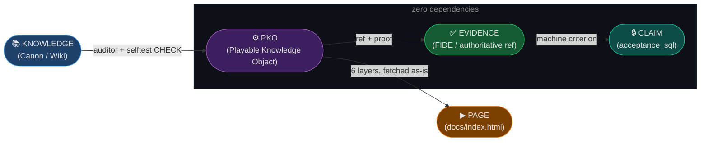

# game-codex — Playable Knowledge Factory

[](https://github.com/Igorz1993/game-codex/actions/workflows/selftest.yml)
[](LICENSE-CODE)
[](LICENSE)

---



> **Core Principle: Every important CLAIM in this repository has an executable CHECK.**
> `CLAIM ──► CHECK ──► EXECUTION ──► RESULT ──► EVIDENCE`

---

## What is a PKO?

A **Playable Knowledge Object (PKO)** is the minimum unit of this factory.
One game rule → one PKO → six representations of the same knowledge:

| Layer | Purpose |
|---|---|
| `answer` | Human-readable explanation |
| `evidence` | Authoritative reference (FIDE rule, paper, etc.) |
| `model` | Formal preconditions and logic |
| `play` | Mini-scene config (`phaser3-scene`) — position, task, solution. Renderer not built yet |
| `quiz` | Questions to test understanding |
| `machine` | `acceptance_sql` — machine-checkable criterion |

```bash
node selftest.mjs   # verifies structure + all PKOs
```

No dependencies, no network, no database, no keys — just Node 18+.

---

## Quick start

```bash
git clone https://github.com/Igorz1993/game-codex
cd game-codex
node selftest.mjs
```

To read the object in a browser, serve the repo root and open `/docs/`
(the page loads the PKO with `fetch`, so `file://` will not work):

```bash
python -m http.server 8000    # then http://localhost:8000/docs/
```

---

## Monorepo layout

```
packages/
  auditor/         ← PKO structural auditor (from DaemonTycoon)

knowledge/
  pko/             ← PKO atoms: *.pko.json — the canon

docs/
  index.html       ← public page: all 6 layers of one PKO, no framework, no CDN
  style.css
  data/            ← byte-copy of knowledge/pko for GitHub Pages; drift is caught by C-05

scripts/
  sync-docs.mjs    ← refreshes docs/data/ from the canon

selftest.mjs       ← C-01…C-05: every claim has a check
LICENSE            ← CC BY 4.0 — knowledge atoms, schemas, docs
LICENSE-CODE       ← MIT — code
```

`docs/data/` is a second copy of the same bytes, which is normally how a
repository starts lying to itself. Here it cannot: `selftest.mjs` (C-05) compares
it byte-for-byte with `knowledge/pko/` and goes red on any divergence. Run
`node scripts/sync-docs.mjs` after editing a PKO.

---

## The public page

[`docs/index.html`](docs/index.html) renders one PKO in full: claim, evidence with a
link to the FIDE source, formal model, a static board position built from the `fen`
field, quiz with hidden answers, and the machine criterion. Nothing is retyped into
the HTML — every value is read from the `.pko.json` at runtime, and an empty field is
drawn as a dash rather than filled in with a guess.

GitHub Pages is **not enabled yet** — that switch belongs to the repository owner.
When it is (source: branch `main`, folder `/`), the page will be served at
`/game-codex/docs/`.

---

## What is not here

- No game engine and no interactive renderer yet. The `play` layer is currently a
  scene *config* inside the PKO plus a static diagram on the public page. An engine
  will be added when there is something that runs, not before.
- No AI model — evidence must be authoritative (FIDE rules, papers, etc.).
- No XKS schema validator. The Python one imported in Phase B arrived byte-corrupted
  and was removed rather than left in place as a green-looking file that never parsed.
- No external users yet. Zero. The first fork that runs the selftest will be the first.

---

## P1: Chess vertical slice

First PKO atom: [`knowledge/pko/chess-en-passant-001.pko.json`](knowledge/pko/chess-en-passant-001.pko.json)

**Claim:** En passant is a special pawn capture valid only on the turn immediately after an opponent's double pawn advance.
**Evidence:** FIDE Laws of Chess 2023, Article 3.7(d).
**Status:** All 6 layers complete. selftest GREEN.
**Readable form:** [`docs/index.html`](docs/index.html) — the same object for a human, rendered from the same JSON.

---

## Donors (Phase A Forensic Merge Map)

This repo grew out of 4 private repos. The full asset-by-asset classification
(ADOPT / EXTRACT / ADAPT / ARCHIVE / REJECT) is not published.

Only what is actually in the tree is listed as taken — everything else is still
sitting in the donors:

| Donor | Role | Taken so far |
|---|---|---|
| `DaemonTycoon` | Factory OS | Auditor engine (`packages/auditor`) — reworked, Firebase/Telegram dependency stripped |
| `knowledge-matrix-contour` | Canon Source | XKS ideas: layer set, provenance and decay stamps |
| `Game` | Public Shell | nothing yet |
| `HeartStone-2` | Simulation | nothing yet |

---

## License

The repository is mixed, so there are two licenses — pick the one matching what you take.

| What | License | File |
|---|---|---|
| **Code**: `selftest.mjs`, `packages/**`, `scripts`, build glue | **MIT** | [`LICENSE-CODE`](LICENSE-CODE) |
| **Knowledge and texts**: `knowledge/**` PKO atoms, schemas, README | **CC BY 4.0** | [`LICENSE`](LICENSE) |

Third-party material keeps its own terms. Authoritative references cited in the
`evidence` layer of a PKO (FIDE Laws of Chess, papers) belong to their rights
holders and are cited, not redistributed.
